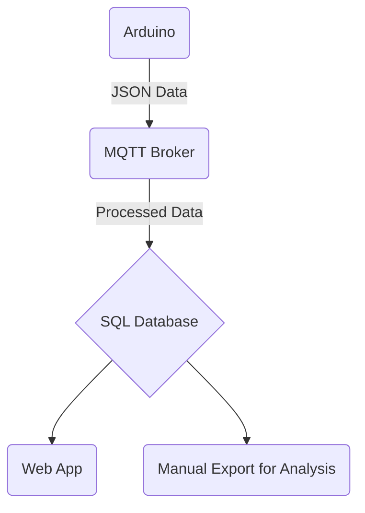

### Hardware/modules used:

- Microcontroller:
  
  - Arduino Nano 33 IoT

- Real Time Clock:
  
  - DS3231

- SD Storage:
  
  - SPI compatible SD card reader
  
  - 8gb MicroSD card

- Environmental Sensors:
  
  - BME280
  
  - PMS5003
  
  - SEN55
  
  - SCD41

### System Layout:

